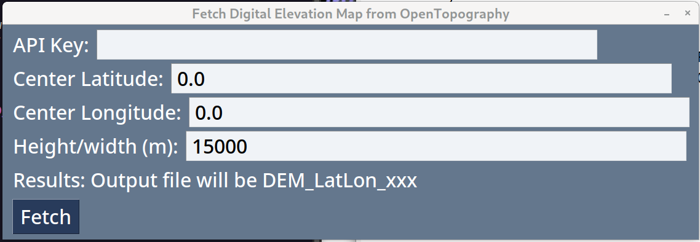

# SRTM-clip-GUI

A Graphical User Interface for downloading a terrain Digital Elevation
Model (DEM) of a specified area on Earth ⛰ 🌎

## About:

Output is saved in the GeoTIFF ".tiff" file format.

This program uses the Python to interact with the [Open
Topography](https://opentopography.org) website to download digital
elavation model/map using their web API.

Data is sourced from the high-quality Shuttle Radar Topography Mission
[SRTM GL1](https://portal.opentopography.org/raster?opentopoID=OTSRTM.082015.4326.1)
Global 30m dataset.

## Usage:

To generate a digital elevation model/map (DEM), enter the center
latitude and longitude of the elevation map along with the
width/height of the surrounding bounding box in meters.  15,000 meters
squared is typical.  An API key is needed to access the OpenTopography
web API and is free to obtain by registering with the site.  Depending
on the platform, you may need to obtain an API key.  You can cut/paste
the API key into this field or set the environment variable
OPENTOPOGRAPHY_API_KEY and it will be automatically read in at
application start time.  

Click the "Fetch" button and your GeoTIFF DEM will automatically be
downloaded and saved into a file in the current directory.  Filenames
take the form "DEM_LatLon_s_w_n_e.tiff" where s, w, n, e, are the
coordinates of the bounding box surrounding the center lat,lon.

## Install

##  Developer environment install:

[Python3](https://www.python.org/) (and the included pip package manager) must be installed first

Ensure your version of `pip` is up to date:
```bash
python3 -m pip install --upgrade pip
```

_Note: "python3" may just be called "python" depending on the configuration of your system_

Then, download this repository to your computer (requires [git](https://github.com/git-guides/install-git)):
```bash
git clone https://github.com/mkrupczak3/SRTM-clip-GUI.git
cd SRTM-clip-GUI
```

Once inside the SRTM-clip-GUI directory, install all pre-requisistes with `pip`:
```bash
python3 -m pip install -r requirements.txt
```

Then run `SRTM_clip_gui.py` to verify your installation:

```bash
python3 SRTM_clip_gui.py
```

Use [PyInstaller](https://pyinstaller.org/en/stable/) to create a distributable executable package:
```bash
pyinstaller -wF --collect-all elevation --icon ./assets/SRTM-cliptool-icon.ico SRTM_clip_gui.py
```

(note that the distributable will be specific to your operating system
and architecture, cross-compiling is not supported)
