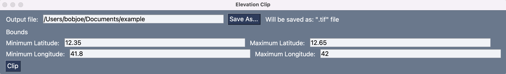
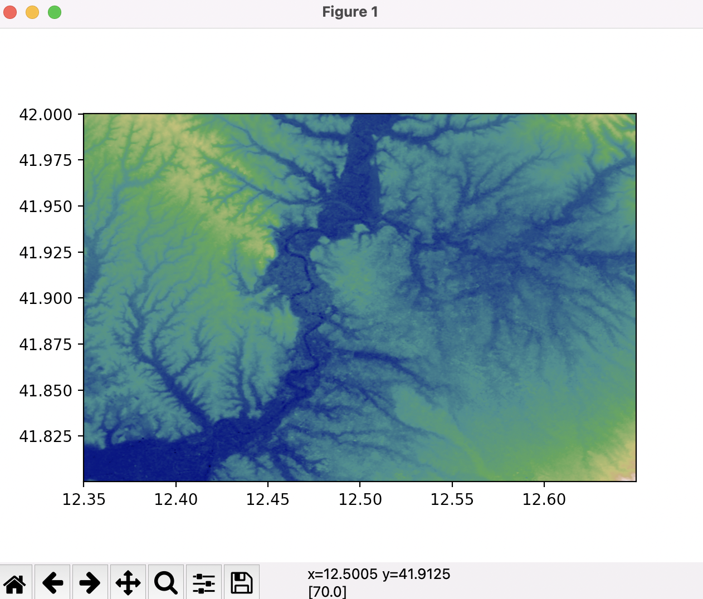

# SRTM-clip-GUI
A Graphical User Interface for downloading a Digital Elevation Model of a specified area

## Usage:

Enter the Minimum Latitude, Maximum Latitude, Minimum Longitude, and Maximum Longitude of the rectangular area you'd like to capture:



Click the "Clip" button, and your GeoTIFF DEM will be downloaded:
<a href="https://github.com/mkrupczak3/OpenAthena#parsegeotiffpy"></a>

## Install
**TBD**

##  Developer environment install:

[Python3](https://www.python.org/) (and the included pip package manager) must be installed first

Ensure your version of `pip` is up to date:
```bash
python3 -m pip install --upgrade pip
```

_Note: "python3" may just be called "python" depending on the configuration of your system_

Then, download this repository to your computer (requires [git](https://github.com/git-guides/install-git)):
```bash
git clone https://github.com/mkrupczak3/SRTM-clip-GUI.git
cd SRTM-clip-GUI
```

Once inside the SRTM-clip-GUI directory, install all pre-requisistes with `pip`:
```bash
python3 -m pip install -r requirements.txt
```

Then run `SRTM_clip_gui.py` to verify your installation:

```bash
python3 SRTM_clip_gui.py
```

Use [PyInstaller](https://pyinstaller.org/en/stable/) to create a distributable executable package:
```bash
pyinstaller -wF SRTM_clip_gui.py
```

(note that the distributable will be specific to your operating system and architecture, cross-compiling is not supported)
